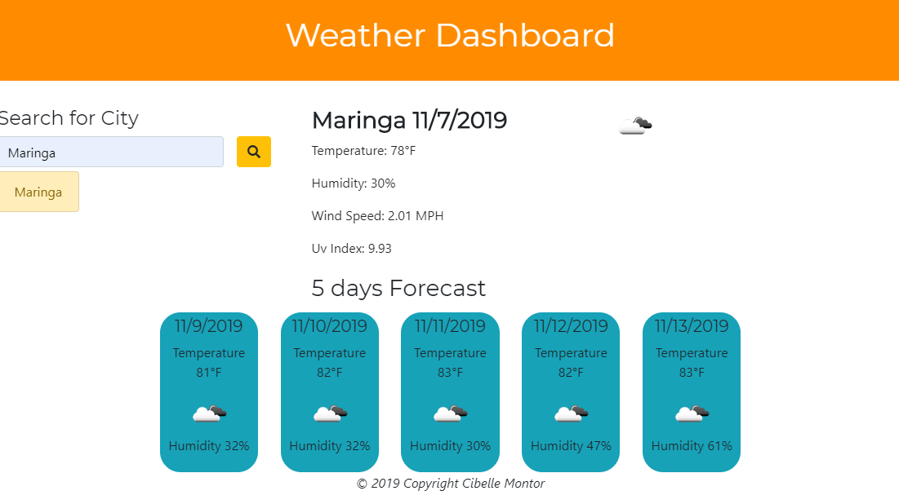
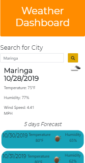

# weatherapp

### Description

This is a Weather Dashboard built using OpenWeather API. The application shows today's weather and a 5 days forecast. For the 5 days forecast and for the UV index I made two extra AJAX calls. The application also displays an icon representation of the actual weather. When the app is seen in a small screen I choose to not display the recent searches to provide a better user experience. This feature is available only in large screens. 

**Key words**: 
*Weather Dashboard*
*Jquery,*
*Apis,*
*localStorage,*
*Moment.js*,
*Ajax Calls*,
*JSON*,
*Bootstrap*

### Technologies-Libraries
- [Bootstrap](https://getbootstrap.com/) - CSS Framework
- [Jquery](https://jquery.com/) - JavaScript Library 
- [Moment.js](https://momentjs.com/) - JavaScript Library 
- [OpenWeather](https://openweathermap.org/current/) - Weather API

-

### Link
Check it out! 
https://cibellem.github.io/weatherapp/

Screenshots of how the application will look different screens sizes. 

  
  
 
